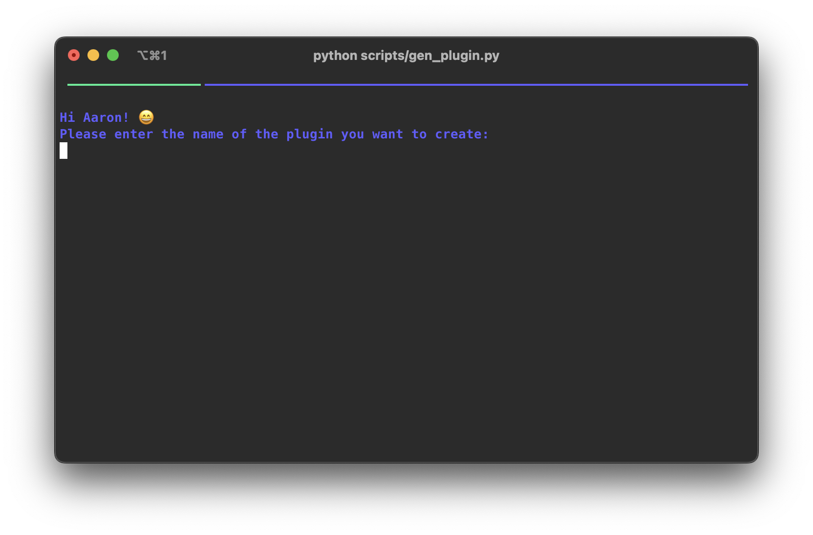

# Overview

Nendo is built to be extensible. You can write your own plugins and use them in your Nendo workflows.
Since plugins are basic python packages, you can use any python package and any framework you like to build your plugins.

In nendo we currently differentiate between four types of plugins.

## Plugin types

=== "Analysis Plugins"

    Plugins that extract information from audio files and add it to the `NendoTrack` object are called analysis plugins.
    Use them whenever you want to extract any type of metadata, things like key, bpm, genre, mood, embedding vectors, etc.

    Examples:

    - [nendo_plugin_classify_core](https://github.com/okio-ai/nendo_plugin_classify_core)

=== "Generate Plugins"

    Plugins that generate one or multiple `NendoTrack`'s from a given input are called generate plugins. 
    Use them whenever you want to generate audio from a given input, e.g. a prompt or another `NendoTrack`.
    Things like music generation, stemification, even quantization, are all generate plugins.

    Examples:

    - [nendo_plugin_musicgen](https://github.com/okio-ai/nendo_plugin_musicgen)
    - [nendo_plugin_stemify_demucs](https://github.com/okio-ai/nendo_plugin_stemify_demucs)
    - [nendo_plugin_vampnet](https://github.com/okio-ai/nendo_plugin_vampnet)
    - [nendo_plugin_loopify](https://github.com/okio-ai/nendo_plugin_loopify)

=== "Effect Plugins"

    Plugins that apply effects to a `NendoTrack` are called effect plugins.
    Use them whenever you want to apply effects to a `NendoTrack`, e.g. reverb, delay, distortion, etc.
    Or more general, whenever you don't want to create a new track in the library 
    but instead want to update the signal of an existing track.

    Examples:

    - [nendo_plugin_fx_core](https://github.com/okio-ai/nendo_plugin_fx_core)

=== "Library Plugins"

    !!! warning
        Library plugins are a special type of plugin, they differ a lot from other plugins and should only be used if you know what you are doing.

    Plugins that implement new DBMS backends for the nendo library are called _library plugins_. To implement a new library plugin, you have two options:

        1. Inherit from the `SqlAlchemyNendoLibrary`, if your taget DBMS is compatible with SQLAlchemy, i.e. an SQLAlchemy driver exists for it. In this case, you only have to implement the initialization of the library as shown bove.
        1. Inherit from the `NendoLibraryPlugin`, and implement a general library plugin that does not use SQLAlchemy to connect to the DBMS backend. In this case, you have to implement/override all public methods defined in the `NendoLibraryPlugin`. Refer to the [API Reference](https://okio.ai/docs/reference/schema/plugin/#nendo.schema.plugin.NendoLibraryPlugin) to see the full list of functions that have to be implemented.
    
    Examples:

    - [duckdb_library](https://okio.ai/docs/reference/library/duckdb_library/)

!!! note
    Make sure that you understand the different plugin types before you start writing your own plugin.

## Thinking about plugins

From a higher level perspective, the steps to write a plugin are:

1. **Idea:** Have an idea about what you want to do with your new nendo plugin. 
Why do you do it? What problem do you want to solve? 
Is there already another plugin for that problem? (Check the [Plugin Catalog](../plugins.md))
2. **Create files:** Create the files described below using the setup script. 
3. **Write code:** Write your plugin code inside your `plugin.py` file.
4. **Test:** Run a nendo instance on your computer and test your plugins functionality. Check if everything is OK.
5. **Document:** Document the functionality of your plugin in the `README.md` file.
Make sure to be concise and clear so that the nendo community can understand what your plugin does.
6. **Publish:** Publish your plugin via pypi and contact us to add it to the official [Plugin Catalog](../plugins.md).
7. **Share:** Share your plugin with the nendo community via the official [discord](https://discord.gg/XpkUsjwXTp) 
or send us a tweet [@okio](https://twitter.com/okio_ai)!


## Plugin files

Here's the directory structure of a typical plugin, in this case `nendo_plugin_quantize_core`:

```shell
├── README.md
├── pyproject.toml
├── setup.py
├── src
│   └── nendo_plugin_quantize_core
│       ├── __init__.py
│       ├── config.py
│       └── plugin.py
```

| File | Description                                                                                 |
| --- |---------------------------------------------------------------------------------------------|
| `README.md` | Contains the documentation of your plugin, usage examples and other information.            |
| `pyproject.toml` | Contains the metadata of your plugin. `nendo` uses `pyproject.toml` to manage dependencies. |
| `setup.py` | Contains the metadata of your plugin.  |
| `src/nendo_plugin_quantize_core/__init__.py` | Contains the metadata of your plugin.  |
| `src/nendo_plugin_quantize_core/config.py` | Contains the configuration of your plugin.  |
| `src/nendo_plugin_quantize_core/plugin.py` | Contains the code of your plugin.  |


!!! info "Plugin naming convention"
    Nendo defines a naming convention based system for loading plugins.
    You can name your plugin whatever you like but we prefer our plugins to start with the prefix `nendo_plugin_`. 
    Also, please mind the naming convention after the `nendo_plugin_` part: First comes the function, 
    then the author/origin of the function it provides.


## General plugin concepts

Your plugin needs to have one class that extends one of the `Nendo*Plugin` classes. 
This class needs to have one or more methods that are decorated with one of the `@run_*` decorators.

### Decorators

Depending on how much functionality you want to add to your plugin, you can use different decorators.
`nendo` handles all the heavy lifting for you, so you can focus on the important stuff.

#### `@run_signal`
This is the preferred decorator for effect plugins and whenever your plugin only works on the `signal` and `sample_rate` level of audio.

Your plugin method needs to have a signature that contains `signal: np.ndarray, sample_rate: int` as the first two arguments.
You can add more arguments to your method, but they need to have default values.
After processing or generating a signal, your method needs to return the processed signal and the sample rate.

!!! info
    `nendo` handles the rest for you and developers can use your plugin with `NendoTrack` or `NendoCollection` objects.

```python
@NendoEffectPlugin.run_signal
def my_run_method(
        self, signal: np.ndarray, sample_rate: int, my_arg: str = "my_value"
) -> Tuple[np.ndarray, int]:
    # do something with the signal
    return signal, sample_rate
```


#### `@run_track`
This decorator is used to run your plugin on a `NendoTrack` object.

Your plugin method needs to have a signature that contains `track: NendoTrack` as the first argument.
Again, you can add more arguments to your method, but they need to have default values.

!!! info
    `nendo` handles the rest for you and developers can use your plugin with `NendoTrack` or `NendoCollection` objects.

```python
@NendoAnalysisPlugin.run_track
def my_run_method(self, track: NendoTrack, my_arg: str = "my_value") -> NendoTrack:
    # do something with the track
    return new_track
```

#### `@run_collection`
This decorator is used to run your plugin on a `NendoCollection` object.

Your plugin method needs to have a signature that contains `collection: NendoCollection` as the first argument.
Again again, you can add more arguments to your method, but they need to have default values.

!!! info
    `nendo` handles the rest for you and developers can use your plugin with `NendoTrack` or `NendoCollection` objects.

```python
@NendoAnalysisPlugin.run_collection
def my_run_method(
        self, collection: NendoCollection, my_arg: str = "my_value"
) -> NendoCollection:
    # do something with the collection
    return new_collection
```


### Initialization  

Usually you don't need to do anything for your classes `__init__()` method. 
However, if you want to instantiate some models or other objects, you can do that here.

!!! tip
    `nendo` initializes all plugin instances on startup by calling their `__init__()` method.

```python
class MyPlugin(NendoAnalysisPlugin):
    def __init__(self):
        self.my_torch_model = load_my_model()
```


## Writing the plugin

You have a great idea for a plugin? Awesome! You already have a name for it? Even better!
You created a new directory for your plugin and added the files described above? Perfect!
You understand all general plugin concepts? Amazing!
Then you are ready to start writing your plugin code.

!!! tip
    If you haven't already, now is the time to clone `nendo`:

    ```shell
    git clone https://github.com/okio-ai/nendo.git
    ```

The recommended way to setup a plugin is via the nendo plugin generator script.
Just run the script follow the wizard and then start coding!

```bash
cd nendo
python scripts/gen_plugin.py
```



Please make sure and think about what type of plugin you want to write.
Since all types differ a bit in how you implement them, use one of the concrete implementation guides below.

- [Library Plugins](libraryplugindev.md)
- [Analysis Plugins](analysisplugindev.md)
- [Generate Plugins](generateplugindev.md)
- [Effect Plugins](effectplugindev.md)


## Running a plugin

Oh you already wrote your plugin code? Great!
Now let's install and run it:

```shell
# assuming we are in your plugin directory
pip install -e .
```

Now we can specify it when starting nendo:

```pycon
>>> from nendo import Nendo, NendoConfig
>>> nd = Nendo(config=NendoConfig(plugins=["nendo_plugin_my_new_plugin"]))
>>> track = nd.library.add_track(file_path='/path/to/track.mp3')
>>> new_track = nd.plugins.my_new_plugin(track=track, my_arg="my_value")
>>> new_track.play()
```

!!! success
    Does it sound correct? Then we're almost done.


[//]: # (TODO add more about testing and debugging and publishing)

## Publishing a plugin

To publish a plugin, simply build and ship a package to your favorite package 
manager and then contact us via our [discord channel](https://discord.gg/XpkUsjwXTp) to
enter the plugin's name in the official [Plugin Catalog](../plugins.md).
